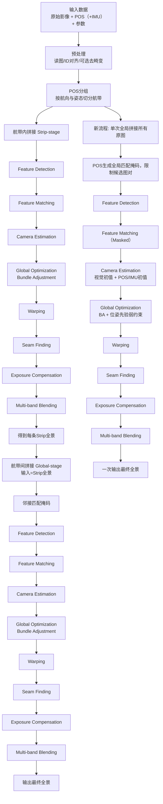

# 无人机遥感影像拼接流程梳理（现状 + 目标新流程）

本文基于当前工程源码（`src/`）整理：

- 当前实际运行流程（`main -> runStitchApplication`）
- 代码中已具备但未接入的全局拼接能力
- 改造成“单次全局拼接所有原始影像 + POS/IMU先验弱约束BA”后的目标流程

---

## 1. 当前工程的实际拼接流程（已接入）

> 入口：`src/main.cpp:3-4` 调用 `runStitchApplication()`（`src/stitch_app.cpp`）。

### 1.1 参数与输入准备

在 `runStitchApplication()` 中固定了本次运行参数（`src/stitch_app.cpp:237-241`）：

- `image_folder = "../images"`
- `image_type = "visible"`
- `group = "two"`
- `pos_path = "../assets/pos.mti"`
- `use_pos = true`

并根据 `image_type` 加载拼接参数预设：

- `StitchTuning tuning = loadStitchTuning(image_type)`（`src/stitch_config.cpp`）
- `visible` 预设关键值：
- `sift_features=2200`
- `strip_sift_features=2200`
- `global_sift_features=3600`
- `match_conf=0.35`
- `use_range_matcher=true, range_width=6`
- `use_affine_bundle=true, use_affine_warper=true`
- `registration_resol=0.45MP, seam_resol=0.12MP, compositing_resol=-1`

### 1.2 图像加载与相机去畸变

图像读入：

- `ImageLoader::loadWithIds(input_folder)`（`src/image_loader.cpp:63-95`）
- 支持扩展名：`jpg/jpeg/png/bmp/tiff`
- 文件按名称排序后读入
- 每张图抽取 `image_id`（文件名 `_` 前缀或去扩展名）用于和 POS 的 `file_id` 对齐

可选去畸变：

- 通过 `findCameraCalibration(tuning, image_type)` 查标定项（`src/stitch_app.cpp:28-37`）
- 若该相机 `isMetricReady()`（内参+畸变都齐）则 `cv::undistort`（`src/stitch_app.cpp:39-81`）
- 当前 `stitch_config.cpp` 里是占位相机参数（`visible/nir/lwir`），默认不会真正去畸变，除非手动填入参数

### 1.3 POS读取与条带分组（“几”字航线的核心）

POS读取：

- `PosReader::load(pos_path)`（`src/pos_reader.cpp`）
- 每行解析 8 列：`time lon lat alt omega phi kappa file_id`

有效性过滤（`PosRecord::isValid()`，`src/pos_record.cpp`）：

- 时间字段不能像经纬度那样包含小数点
- 经纬度绝对值不能过小
- 高度需 `>= 50m`

条带分组：`PosBasedImageGrouper::groupWithRecords(...)`（`src/pos_image_grouper.cpp`）

1. 构建 `image_id -> deque<image>` 映射（处理同 ID 多图情况）
2. `groupByFlightStrips()` 执行状态机分条带：
- 先做“测区高度过滤”：保留高度 `>= 0.9 * max_alt`
- 用相邻GPS点计算飞行航向 `bearing`（不是直接用 kappa）
- 状态机：`TURNING <-> COLLECTING`
- 依据航向突变、与最近均值差异、`omega` 跳变切分条带
- 对候选条带做“主飞行轴一致性过滤”（几字往返时轴线一致，只是方向相反）
3. `trimStripEdges()` 对每条 strip 首尾做转弯段裁切：
- 基于中间50%记录估计核心航向
- 同时用航向偏差 + 横向偏距（cross-track）双条件去掉边缘转弯图
4. strip 内按时间排序，将 POS `file_id` 与图像 `image_id` 对齐，形成 `FlightStripGroup{images, records}`

### 1.4 条带排序（跨航带方向）

当 `use_pos && strip_groups.size()>1` 时，调用：

- `orderStripGroupsByCrossTrack(strip_groups)`（`src/stitch_global.cpp:18-50`）

做法：

- 先估计全局飞行轴方向
- 计算每条 strip 的重心经纬度
- 投影到横航向轴，按横向位置排序（保证条带从一侧到另一侧有序）

### 1.5 当前两阶段拼接策略（实际运行）

当前是典型“分层拼接”：

#### 阶段A：逐条带拼接（strip-stage）

对每个 `FlightStripGroup`：

1. `removeRedundantImages()`（`src/stitch_app.cpp:159-230`）
- 计算相邻POS点距离中位数
- 用 `0.3 * median_distance` 作为阈值去掉悬停/近重复图
2. `stitchRobustly(strip_images, SCANS, "StripX", strip_tuning, range_width, tags)`
- `strip_tuning.sift_features` 使用 `strip_sift_features`
- 主要由 `src/stitch_robust.cpp` 封装 OpenCV Stitcher 全流程
3. `autoCropBlackBorder()` 自动裁黑边
4. 保存中间条带全景 `output/.../strips/strip_xx.jpg`

#### 阶段B：条带全景再拼接（global-stage）

输入不再是原始影像，而是“每条带的全景图”。

1. 构造 `global_tuning`：
- `sift_features = global_sift_features`
- 强制 `use_range_matcher=false`
- `range_width=2`
- `blend_bands` 最多 3 层
2. 构造邻接掩码：`makeAdjacentStripMask(n,1)`
- 只允许相邻条带配对（i 与 i±1）
3. 再次调用 `stitchRobustly(strip_panoramas, ..., matching_mask)`
- 注意：有 `matching_mask` 时如果 one-shot 失败会直接报错，不做顺序回退（`src/stitch_robust.cpp:359-363`）

最终：

- 对最终全景再 `autoCropBlackBorder()`
- `cv::imwrite(output_path, panorama)`

### 1.6 `stitchRobustly` 内部通用拼接子流程

`stitchRobustly()`（`src/stitch_robust.cpp`）核心机制：

1. 创建并配置 `cv::Stitcher`：
- 特征：SIFT
- 匹配器：RangeMatcher 或 BestOf2NearestMatcher
- BA：`BundleAdjusterAffinePartial`
- Warper：`AffineWarper`（可配置）
- 接缝：`DpSeamFinder(COLOR_GRAD)`
- 曝光补偿：`BlocksGainCompensator`
- 融合：`MultiBandBlender`

2. one-shot 尝试：
- `estimateTransform()` -> `composePanorama()`

3. 失败回退：
- 若未设置 `matching_mask`，回退到顺序拼接 `stitchSequentially()`
- 若设置了 `matching_mask`，直接抛异常（不顺序回退）

4. 2图场景预诊断：
- 先做 SIFT+BF+RANSAC，检查 `good_matches` 和 `inliers`
- 低于阈值直接判定失败，便于日志定位

5. OpenCL 失败兜底：
- 识别 OpenCL 运行时异常后自动关闭 OpenCL 并 CPU 重试

---

## 2. 代码中“已存在但未接线”的能力

`src/stitch_global.cpp` 提供了两套函数，但当前 `runStitchApplication()` 没有调用：

- `buildGlobalStitchInput(strip_groups, tuning)`
- `stitchGlobalPipeline(images, match_mask, tuning)`

这套代码的特征：

- 输入是“所有原始图像”（而非条带全景）
- 基于 POS 生成配对掩码：
- strip 内：按位置差 `<= range_width`
- strip 间：对邻近条带选 KNN（`cross_k=4`）近邻配对
- 使用 detail API 显式执行：
- features -> masked matching -> leaveBiggestComponent
- Affine estimator + BA
- seam warping / exposure / seam finding / compositing / blending

换言之，项目里已经有“单次全局拼接原图 + POS匹配掩码”的技术雏形，只差主流程接入与先验BA增强。

---

## 3. 目标新流程（按你的要求改造后应是什么）

目标要求：

- 单次全局拼接所有原始影像
- 用 POS 生成匹配掩码限制配对
- 一次性 BA
- 把 POS/IMU 作为位姿先验加入优化，至少“弱约束BA”以抑制条带漂移

下面给出建议的“改造后端到端流程”。

### 3.1 新流程总览

1. 读图 + 读 POS/IMU + （可选）去畸变
2. POS 清洗 + 条带识别（用于建图先验，不再做两阶段拼接）
3. 构建“全图节点图”与配对掩码（in-strip + inter-strip）
4. 全部原图一次性特征提取与受限匹配
5. 估计初值位姿（视觉初值 + POS初值融合）
6. 单次全局 BA（视觉重投影误差 + 位姿先验约束）
7. 全局warp、接缝、曝光补偿、融合，输出最终大图

### 3.2 关键模块拆解

#### A. 数据准备层

输入：

- 原始影像 `I_i`
- 每张影像对应 POS/IMU：位置 `(lon,lat,alt)`，姿态 `(omega,phi,kappa)`，时间戳
- 标定参数：内参、畸变、lever-arm、boresight（可先部分缺省）

处理：

- 时间同步修正（camera_time_offset）
- 坐标统一（WGS84 -> 局部 ENU）
- 姿态定义统一（明确 body->nav / nav->body 与欧拉顺序）

产物：

- 每图先验平移 `t_i^prior`
- 每图先验旋转 `R_i^prior`
- 先验协方差/权重（可按 GNSS 与 IMU 品质设定）

#### B. 匹配图构建层（POS掩码）

目标：把候选对从 O(N^2) 压缩到“物理上可能重叠”的子集。

建议规则：

- strip 内邻域：`|index_i - index_j| <= W_in`
- strip 间邻域：仅相邻（或次相邻）条带
- 空间门控：ENU 距离 `< d_max`
- 航向门控：`|heading_i - heading_j| < theta_max`
- 重叠率粗估门控：FOV 投影重叠 `< overlap_min` 则跳过

结果：

- 稀疏匹配掩码 `M(i,j) ∈ {0,1}`

#### C. 单次全局视觉估计层

1. 所有原图统一提特征（一次）
2. 仅对 `M(i,j)=1` 的图对做匹配 + 几何验证（RANSAC）
3. 建立全局图 `G(V,E)`（节点=影像，边=有效匹配）
4. 取最大连通子图（必要时）
5. 视觉初始化（Affine/Homography 或近似位姿）

#### D. 弱约束 BA（核心）

优化变量：

- 每张图位姿 `T_i = (R_i, t_i)`
- 可选：统一/分组焦距与畸变微调

目标函数（示意）：

- `E = Σ E_reproj(i,j,k) + λ_t Σ ||t_i - t_i^prior||^2_{Σ_t^-1} + λ_r Σ ||Log(R_i^prior^-1 R_i)||^2_{Σ_r^-1}`

解释：

- 第一项：视觉重投影误差（主项）
- 第二项：位置先验（弱约束）
- 第三项：姿态先验（弱约束）
- `λ_t, λ_r` 不宜过大，避免“硬锁死”导致局部错配无法被视觉纠正

推荐策略：

- 分阶段权重：先较强先验稳定图形，再逐步下调到弱约束
- 鲁棒核：Huber/Cauchy 抑制错误匹配和偶发POS跳变
- 对无POS或低置信图像，自动降低先验权重

#### E. 全局合成层

- 用 BA 后位姿一次性 warp 所有图
- 曝光补偿（BlocksGain）
- seam finding（DP seam）
- multi-band blending
- 裁黑边并输出

### 3.3 与当前流程的本质差异

当前流程：

- 先“条带内拼出局部全景”再“条带全景二次拼接”
- 实际发生两次独立估计/融合，误差会在阶段间传递

新流程：

- 所有原图进入同一全局图，只有一次全局BA
- POS/IMU先验在同一优化中约束全局几何
- 能显著降低条带间累积漂移与二次拼接接缝错位

---

## 4. 建议的代码落地路径（对应本工程）

### 4.1 主流程改造

在 `runStitchApplication()` 里把“strip-stage + strip_panoramas global-stage”替换为：

1. 保留 `PosBasedImageGrouper::groupWithRecords`（只用于组织拓扑/掩码）
2. 调用 `buildGlobalStitchInput(strip_groups, tuning)` 生成：
- `all_images`
- `match_mask`
3. 调用增强后的 `stitchGlobalPipeline(...)` 完成一次性全局拼接

### 4.2 BA增强点

当前 `stitchGlobalPipeline` 里已有：

- `AffineBasedEstimator`
- `BundleAdjusterAffinePartial`

需要新增：

- 将 POS/IMU 先验转为每图 `R_prior, t_prior`
- 在 BA 中增加先验残差项（可通过自定义 BA 或接入 Ceres/g2o 实现）
- 提供先验权重配置项：`prior_pos_weight`, `prior_rot_weight`

### 4.3 配置项建议新增（`StitchTuning`）

- `bool use_pose_prior = true`
- `double prior_pos_weight = ...`
- `double prior_rot_weight = ...`
- `double max_pair_distance_m = ...`
- `double max_pair_heading_diff_deg = ...`
- `int inter_strip_neighbor_k = ...`

---

## 5. 当前代码状态结论

1. 当前运行路径确实是“两阶段拼接”：
- 条带内拼接（原图）
- 条带间拼接（条带全景）

2. 项目内已经有“单次全局拼接原图+POS掩码”的基础代码（`stitch_global.cpp`），但还未接入主流程。

3. 你提出的新方案在本工程中是可演进的：
- 先接入 `buildGlobalStitchInput + stitchGlobalPipeline`
- 再在 BA 层加入 POS/IMU 弱约束先验
- 最终形成“单次全局 + 先验BA”的目标架构

---

## 6. 关键源码定位索引

- 程序入口：`src/main.cpp`
- 主流程：`src/stitch_app.cpp`
- 拼接参数：`src/stitch_config.hpp/.cpp`
- 读图：`src/image_loader.cpp`
- POS读入：`src/pos_reader.cpp`
- POS记录有效性：`src/pos_record.cpp`
- POS分条带：`src/pos_image_grouper.cpp`
- 条带排序 / 全局掩码 / 全局细节拼接：`src/stitch_global.cpp`
- 鲁棒拼接封装（OpenCV Stitcher + 回退）：`src/stitch_robust.cpp`
- 通用工具（裁边/角度/航轴）：`src/stitch_common.cpp`

---

## 7. 新流程（阶段时序版）

适用于“单次全局拼接所有原始影像 + POS配对掩码 + 一次性BA + 位姿先验弱约束”的目标方案。

1. 输入与预处理：读取原始影像、POS（+IMU），完成ID对齐与可选去畸变。  
2. POS建图：基于POS构建候选配对关系（航带内邻域 + 航带间邻接），生成全局匹配掩码。  
3. 全图特征阶段：对所有原始影像进行 `Feature Detection`。  
4. 受限匹配阶段：在掩码约束下执行 `Feature Matching (Masked)`。  
5. 初值估计阶段：执行 `Camera Estimation`（视觉初值 + POS/IMU初值）。  
6. 全局优化阶段：执行 `Global Optimization / Bundle Adjustment`，并加入“位姿先验弱约束”。  
7. 统一重投影阶段：执行 `Warping`。  
8. 接缝估计阶段：执行 `Seam Finding`。  
9. 光照统一阶段：执行 `Exposure Compensation`。  
10. 融合输出阶段：执行 `Multi-band Blending`，一次输出最终全景。

---

## 8. Mermaid 流程图

---

## 9. 英文术语解释

- `Strip-stage`：航带内阶段。先在每条航带内部完成拼接。  
- `Global-stage`：全局阶段。把各航带结果进行跨航带拼接。  
- `Feature Detection`：特征检测。提取稳定、可重复的关键点。  
- `Feature Matching`：特征匹配。建立图像间关键点对应关系。  
- `Feature Matching (Masked)`：带掩码匹配。仅在掩码允许的图对上匹配。  
- `Camera Estimation`：相机估计。估计每张图的相对位姿/相机参数。  
- `Global Optimization`：全局优化。联合全部图像关系做统一求解。  
- `Bundle Adjustment (BA)`：光束法平差。最小化重投影误差的联合优化。  
- `BA + 位姿先验弱约束`：在BA中加入POS/IMU先验，但以较小权重约束，抑制漂移同时保留视觉修正能力。  
- `Warping`：图像重投影/几何变换。把图像映射到统一拼接坐标系。  
- `Seam Finding`：缝线搜索。确定重叠区最佳过渡边界。  
- `Exposure Compensation`：曝光补偿。减小亮度/色调不一致。  
- `Multi-band Blending`：多频段融合。通过多尺度融合获得平滑且清晰的拼接结果。  
- `Masked`：受掩码约束，表示不是全连接匹配而是按规则筛选候选图对。
